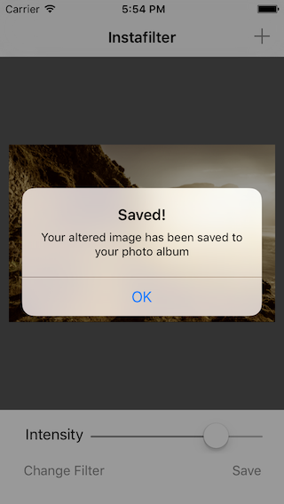

# Instafilter
Repo following Project 13: Instafilter using Core Image and UISlider at www.hackingwithswift.com.  The goal of this project is to gain familiarity with Core Image and filters available.



## Concepts Learned/Practiced
* Core Image
* UISlider
* ```UIImageWriteToSavedPhotosAlbum()```
  * Writes the image to photo album by giving it a ```UIImage```.
  * Method takes 4 parameters:
    * Image to write
    * Who to tell when writing has finished ('self' in this case)
    * What method to call
    * Any context
* ```CIContext```
* ```CIFilter``` - different filters available to use such as Sepia, Blur, Pixellated, etc.
* Importing a picture (```UIImage```)
* ```UIImagePickerController``` to select photo from photo album

## Attributions
[Project 13: Instafilter: Core Image and UISlider at hackingwithswift.com](https://www.hackingwithswift.com/read/13/overview)
